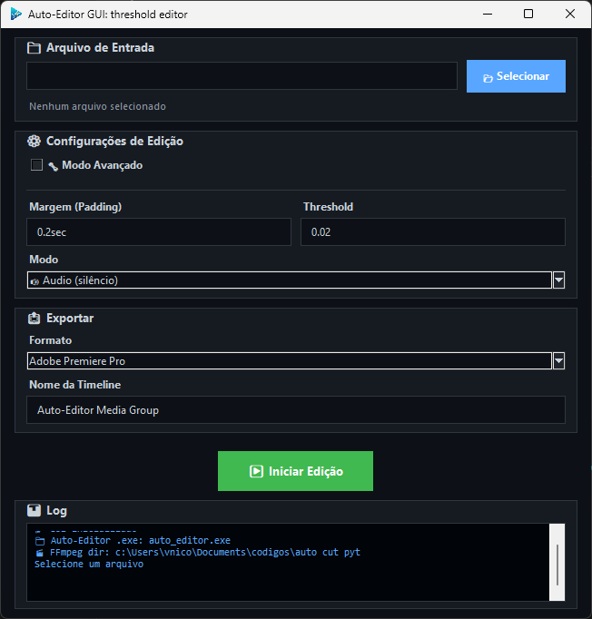

# Auto Editor Gui



Este repositório fornece uma interface gráfica em Python para o projeto "auto-editor" (Auto-Editor), permitindo ajustar thresholds/margens e exportar marcações para diversos editores de vídeo. A GUI principal é `autocutgui.py` e o projeto inclui scripts auxiliares para baixar dependências (por exemplo, FFmpeg e o binário do auto-editor) em `install.py`.

**Requisitos**

- **Python:** Testado com Python 3.8+.
- **Dependências:** listadas em `requirements.txt` (por exemplo `auto-editor`, `pyinstaller`).
- **FFmpeg:** Necessário para processamento de áudio/vídeo. O projeto fornece um script (`install.py`) que baixa uma build do FFmpeg para Windows.

**Instalação**

1. Crie e ative um ambiente virtual (opcional, recomendado):

```powershell
python -m venv .venv
.\.venv\Scripts\Activate.ps1
```

2. Instale as dependências:

```powershell
pip install -r requirements.txt
```

3. (Opcional) Baixe FFmpeg e o binário do auto-editor usando o script `install.py`:

```powershell
python install.py
```

O `install.py` tenta baixar uma build estática do FFmpeg (arquivo ZIP) e o executável do auto-editor para Windows, renomeando/extraindo quando necessário.

**Uso**

- Para iniciar a interface gráfica (modo de desenvolvimento):

```powershell
python autocutgui.py
```

- Fluxo de uso na GUI:
  - `📂 Selecionar`: escolha o arquivo de entrada (vídeo/áudio).
  - Configure `Margem` e `Threshold` ou ative `🔧 Modo Avançado` para fornecer uma expressão personalizada.
  - Escolha o formato de exportação (por exemplo, Adobe Premiere) e defina o nome da timeline quando aplicável.
  - Clique em `▶️ Iniciar Edição` para executar o binário `auto_editor.exe` com os argumentos montados pela GUI.

Observações:
- A GUI assume que um executável `auto_editor.exe` (ou `auto-editor_windows_amd64.exe` renomeado) esteja no mesmo diretório base do script ou embutido no pacote quando empacotado com PyInstaller.
- A GUI também procura por `ffmpeg.exe` no diretório base e adiciona esse diretório ao `PATH` do processo antes de chamar o `auto_editor.exe`.

**Empacotamento / Build**

O repositório já contém uma pasta `build/` (possivelmente gerada por PyInstaller). Para gerar um executável você pode usar `pyinstaller` manualmente ou um script de build se existir.

Comandos úteis para empacotar localmente:

```powershell
# Gerar executável com PyInstaller (exemplo simples)
pyinstaller --onefile --add-data "ffmpeg.exe;." autocutgui.py

# Ou usar um script de build se presente:
python build.py
```

Dicas de empacotamento:
- Inclua `ffmpeg.exe` e `auto_editor.exe` ao lado do executável final (ou dentro do `_MEIPASS` se empacotado), pois a GUI espera encontrá-los no mesmo diretório base.

**Arquivos importantes**

- `autocutgui.py`: interface gráfica principal em Tkinter.
- `install.py`: script simples para baixar FFmpeg e o binário do auto-editor no Windows.
- `requirements.txt`: dependências Python (`auto-editor`, `pyinstaller`, ...).
- `build/`: diretório contendo artefatos gerados (pode ser resultado do PyInstaller).

**Notas e recomendações**

- Antes de rodar a GUI, verifique se `auto-editor` (binário) e `ffmpeg.exe` estão disponíveis no diretório do script ou no `PATH` do sistema.
- O `install.py` baixa versões pré-compiladas para Windows; revise URLs caso deseje versões específicas.
- Se encontrar erros de codificação no Windows, a GUI tenta forçar UTF-8 nas streams e utiliza fallback para codificações locais.

**Exemplo rápido (PowerShell)**

```powershell
# Ativar ambiente e instalar
python -m venv .venv
.\.venv\Scripts\Activate.ps1
pip install -r requirements.txt

# Baixar binários auxiliares
python install.py

# Executar GUI
python autocutgui.py
```

**Licença**

O repositório não contém um arquivo de licença explícito. Adicione um `LICENSE` conforme suas necessidades (por exemplo MIT, Apache-2.0) ou informe qual licença deseja aplicar.

**Contato / Contribuição**

Sinta-se à vontade para abrir issues ou pull requests no repositório. Para contribuições locais, crie uma branch, adicione testes (se aplicável) e abra um PR com uma descrição clara das mudanças.

---

Se quiser, eu posso:
- Rodar uma verificação rápida de estilo ou dependências;
- Adicionar um `LICENSE` (por exemplo MIT);
- Criar um script de build mais robusto ou `README` em inglês também.
